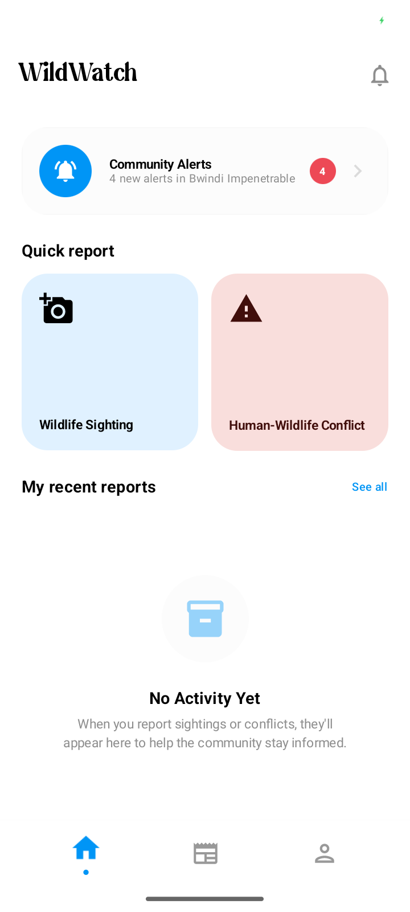
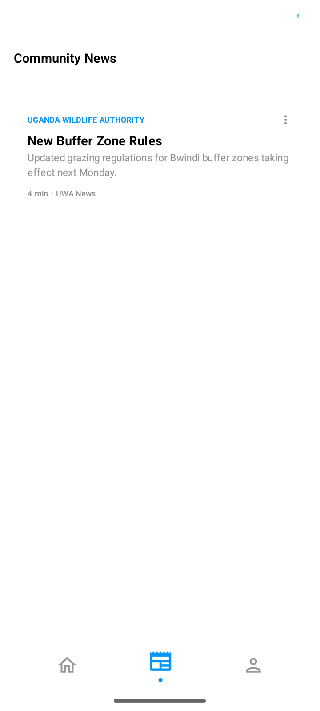
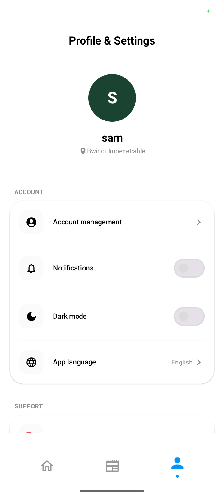
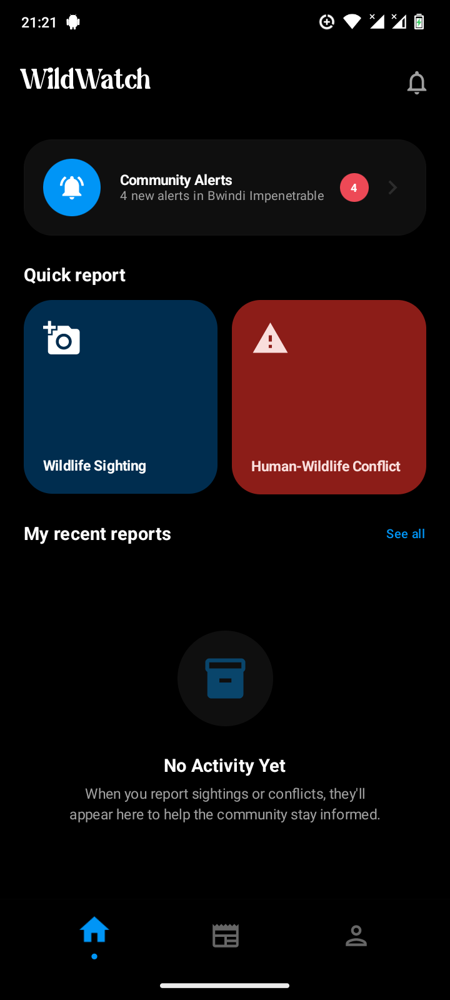
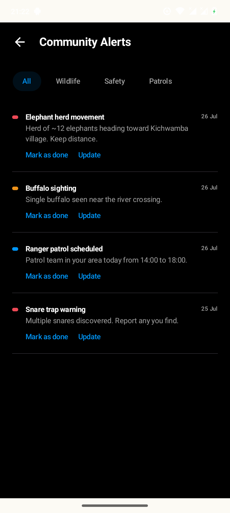
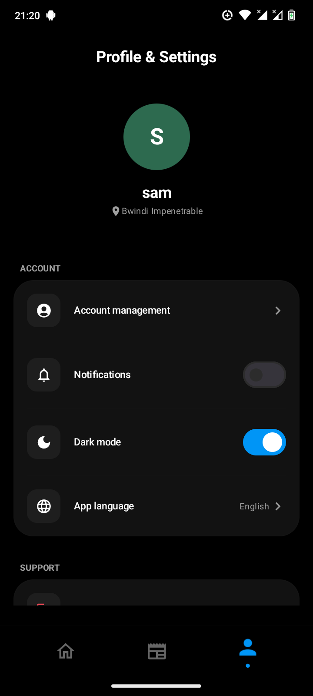

<div align="center">
  
  <h1>SilverBack Sentry</h1>
  <p>Wildlife conservation reporting and ranger operations in Uganda — native Android app + Firebase backend, one repository.</p>
</div>

<!-- Note: art/icons/ic_launcher_foreground_exact.png (previously referenced here) predates the
     2026-08-13 icon fix and shows the old mountain-chevron mark, not the ring+"W" mark the app
     actually ships now (app/src/main/res/drawable/ic_launcher_foreground.xml) - swapped to the
     reference webp above rather than a stale export. Worth generating a fresh PNG export from
     the corrected vector drawable at some point rather than relying on the design-reference file. -->


## What this is

SilverBack Sentry is an offline-first Android app serving two audiences: rangers, who use it for incident response, patrol tracking, and evidence collection, and the public, who use it to report wildlife sightings and human-wildlife conflict incidents. It is built with Kotlin and Jetpack Compose, backed by Firebase (Authentication, Firestore, Storage, Cloud Messaging), with Room providing local persistence and an offline outbox so reports and patrol data can be captured with no signal and synced automatically once connectivity returns.

This repository is the single home for **both** the Android application and its Firebase backend (Cloud Functions, Firestore/Storage security rules, hosting, and seed scripts) — formerly split across two branches (`master` and `backend`), consolidated into one tree so the app and the platform it runs on evolve together.

The app's data reaches a separate Laravel-based web portal (`../warden-web-portal/`) for wardens and UWA officials through a Firebase-to-Laravel bridge; the full contract for what data crosses that bridge and how is documented in `/home/geto/Projects/Documentations/WildWatch/root-contracts/BRIDGE-CONTRACT.md`. Which features and screens a signed-in account can reach depends on its role — ranger, warden, UWA official, or public — documented in `/home/geto/Projects/Documentations/WildWatch/root-contracts/REPOS.md`'s role-model write-up alongside the equivalent portal-side roles.

The Firebase project runs on the Spark (free) plan, which cannot run Cloud Functions at all — so for incidents (which also covers wildlife sightings and SOS alerts — a one-tap SOS button on Home opens the report form pre-set to the SOS type; all three are just an `Incident` row with a different `type`), this app calls the Laravel API directly right after a successful Firestore write, instead of relying on a Cloud Function to relay it. See `IncidentRepositoryImpl.syncPending()` and `LARAVEL_API_BASE_URL` below. Other Cloud-Functions-dependent behavior (default role/claims on signup, the 3-device session cap, push notification triggers) has not been redesigned for Spark yet and does not currently run.

## Repository layout

```
app/                      Android application module (Kotlin + Compose)
functions/                Cloud Functions (TypeScript) — bridge, device sessions, notifications
hosting/                  Firebase Hosting — email-link sign-in landing page + assetlinks
scripts/                  Firebase seed script (auth users, parks, incidents, feed) + fixtures
app/../firebase.json      Emulator suite config (firestore, functions, storage, hosting)
firestore.rules           Firestore security rules (RBAC: ranger/public/warden/uwa_official)
storage.rules             Storage security rules (incident media, feed images, avatars)
scripts/                  generate_parks_geojson.mjs — park boundary GeoJSON generator
art/                      Branding, screenshots, launcher references
```

## Capabilities

Incident and wildlife-sighting reporting with camera capture and GPS tagging, submitted through an offline-first outbox that queues locally and syncs when connectivity allows. A ranger tracking screen showing live location, incident pins, and park points of interest, including an in-app flow for flagging new points of interest such as danger zones. Background patrol tracking that persists a ranger's route locally, syncs it periodically, and correctly resumes rather than duplicating a patrol if the app process is killed mid-patrol. Push notifications with tap-to-deep-link behavior into the relevant screen, and a fully-opaque unread-count badge on the home and dashboard bells (fixed 2026-08-13 — it used to render at 15% opacity, functionally invisible against most backgrounds). Offline map regions: the base map for a ranger's assigned park downloads automatically in the background over an unmetered connection, so the map keeps working without signal in the field. Community news feed with a staggered image grid (redesigned 2026-08-13 in the spirit of Now in Android's "For You" screen), authored from the web portal including optional header images. Guest mode ("Continue without account") for reporting without creating an account — as of 2026-08-13 this no longer blocks on connectivity: it enters local guest mode immediately if the anonymous sign-in network call fails, and retries it automatically once back online, instead of leaving the user stuck on the Auth screen. Light and dark themes including a true-black dark mode, with status bar icon contrast that reactively follows the actual resolved in-app theme (fixed 2026-08-13 — it used to only reflect system config at launch, which could disagree with an in-app theme override).

## Backend functions

The `functions/` module implements the Firebase side of SilverBack Sentry's two-backend architecture, driving the app's authentication, offline-sync data store, file storage, and push notifications:

- `functions/src/bridge.ts` + on-write triggers in `functions/src/index.ts` — sign and forward incident, sighting, and SOS-alert writes to the Laravel API in `../warden-web-portal/backend/` as HMAC-authenticated webhooks, with an echo-prevention check so a write that originated on the Laravel side doesn't bounce back out as another webhook call.
- `functions/src/notifications.ts` — topic-based push notification triggers.
- `functions/src/deviceSessions.ts` — per-user device session management and the 3-device cap.

Custom claims assigned here (`role`, `park_id`) are what the mobile app, the portal, and the security rules in this repository all use to authorize access — see `/home/geto/Projects/Documentations/WildWatch/root-contracts/REPOS.md`'s role-model write-up for the current set of roles and how they map across systems.

## Tech stack

Jetpack Compose with Material 3 for UI, an MVVM architecture, Hilt for dependency injection, Room for local persistence, Firebase (Authentication, Firestore, Storage, Cloud Messaging, Functions) for the backend, the Mapbox Maps SDK for mapping and offline tile regions, Kotlin Coroutines and Flow for asynchronous and reactive code, WorkManager for background sync and downloads, and Timber for logging. Backend: Cloud Functions in TypeScript, Jest for function tests, Firebase CLI for deployments.

## CI/CD

Every push to `master` runs the JVM unit test suite, builds a debug APK, and attaches it to a new GitHub release (`.github/workflows/release.yml`, added 2026-08-13). Needs three repo secrets to actually build (`MAPBOX_DOWNLOADS_TOKEN`, `MAPBOX_PUBLIC_TOKEN`, `LARAVEL_API_BASE_URL` — see the workflow file's own header comment for exactly what each is and where to get it). One known gap: the CI runner's auto-generated debug keystore has a different SHA-1 than the one already registered with the Firebase project for Google Sign-In, so that one sign-in method doesn't work on CI-built APKs specifically — every other sign-in method, and the app generally, is unaffected.

The backend (rules + functions) is **not** covered by CI/CD — deploy it by hand with `firebase deploy` (e.g. `firebase deploy --only firestore:rules,storage` after a rules change). That is deliberate: there is no build artifact or hosted service for rules/function source the way an APK is, so a workflow would add little. The Cloud Functions Jest suite still runs locally with `cd functions && npm test`.

## Running against a real Firebase project

This is now the intended default. Add a real `google-services.json` for the target Firebase project to the `app/` directory, and leave `USE_LOCAL_BACKEND` unset or set to false in `local.properties` so the app connects to real Firebase services rather than emulator hosts. A Mapbox access token is required regardless of backend target and is set in `local.properties` as well.

Deploy the Firestore rules, Storage rules, and Cloud Functions from this repository to the real project — **as of 2026-08-13, real project `wildwatch-82abc` is live** (Spark/free plan — no Cloud Functions run today, see `/home/geto/Projects/Documentations/WildWatch/root-contracts/HOSTED-CUTOVER-PLAN.md` for what that means for the bridge), with rules deployed and real seeded data. A rules change deploys with `firebase deploy --only firestore:rules,storage` from this repository's root. Cloud Functions configuration — the shared HMAC secret and the Laravel webhook base URL — must be set to real, rotated values that match what the Laravel side is configured with exactly; the local emulator's placeholder secret must not be reused.

Set `LARAVEL_API_BASE_URL` in `local.properties` to the deployed Laravel API's base URL (ending in `/api/`) — this is what incident/sighting/SOS reports use for the mobile-direct bridge described above; without it, those reports still save to Firestore but never reach the portal's database.

## Running against local Firebase emulators

The full local Docker stack that used to wire Firebase emulators, the Laravel API, and the portal frontend together has been retired; there is currently no packaged local full-stack environment. Firebase's own emulator suite (Auth, Firestore, Storage, Cloud Functions) can still be run directly from this repository root with the Firebase CLI (`firebase emulators:start`, config in `firebase.json`) — start it, then in `local.properties` set `USE_LOCAL_BACKEND=true` and `LOCAL_BACKEND_HOST` to the address the emulators are reachable at. For the Android Emulator, `10.0.2.2` reaches the host machine; for a physical device on the same Wi-Fi, the recommendation is to use the host machine's actual LAN IP instead, since it works for both the emulator and any physical device without needing to be swapped per test target — it does need updating whenever that IP changes. For a physical device with no shared Wi-Fi, forward the emulator's Auth, Firestore, Cloud Functions, and Storage ports from the host over USB instead, then point `LOCAL_BACKEND_HOST` at the loopback address. Rebuild after changing `local.properties`. Emulators serve plain HTTP, and physical devices block cleartext connections by default; the debug build's network security configuration permits cleartext for debug builds only, merged automatically over a strict configuration that release builds always use, so nothing needs editing there when a LAN IP changes. The hosted-Firebase path above is the primary documented workflow; this is the fallback when a real project isn't available.

## Getting started

Open this repository in Android Studio, sync Gradle, and run on a physical device or emulator. Java 17 or newer and a recent Android Studio release are required. The Firebase CLI and Node.js (with `npm install` in `functions/` and `scripts/`) are additionally needed only when working on the backend rules, Cloud Functions, or seed script.

## Testing

Unit tests run through Gradle's standard test task and use mocked repositories rather than a real device or emulator. An instrumented test suite also exists but currently requires an Android emulator or device to run and has known gaps in what it covers versus what actually gets exercised in day-to-day development — treat its coverage as unverified until it's confirmed to run cleanly in whatever environment is being used.

Cloud Functions have a Jest test suite (`functions/src/__tests__/`) exercising the trigger-dispatch logic, the bridge's HMAC signing and echo-prevention functions in isolation, and the role-assignment callable's authorization logic. Coverage is deliberately prioritized toward the bridge and authorization code rather than the full surface.

## Screenshots

| Home Dashboard | Community News | Profile & Settings |
|:---:|:---:|:---:|
|  |  |  |
|  |  |  |

*These predate the 2026-08-13 fixes (feed's staggered image grid, the corrected launcher icon, the now-visible unread badge, the reactive status bar) — worth recapturing, not done as part of this pass.*

## Further reading

`AGENTS.md` in this repository has the fuller development lifecycle and conventions. `/home/geto/Projects/Documentations/WildWatch/root-contracts/REPOS.md` has the full cross-repository map and role model. `/home/geto/Projects/Documentations/WildWatch/root-contracts/BRIDGE-CONTRACT.md` has the field-level Firebase-to-Laravel bridge contract. `/home/geto/Projects/Documentations/WildWatch/root-contracts/HOSTED-CUTOVER-PLAN.md` has the hosted-services cutover procedure.